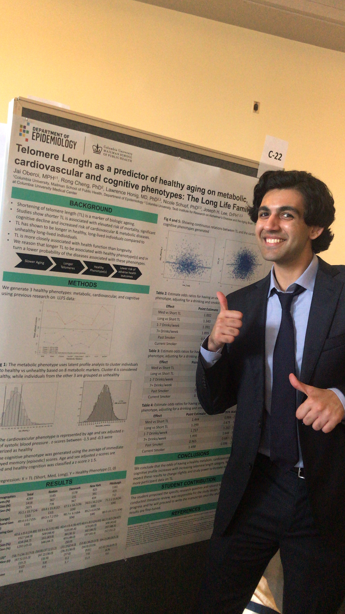

My name Jai Oberoi, this is my [website](jaioberoi.github.io). 

I am a second year MPH candidate at [Columbia University, Mailman School of Public Health](https://www.mailman.columbia.edu/). I study *Epidemiology* and *Biostatistics*. 

Currently, I work at [Columbia University Irving Medical Center](https://www.cuimc.columbia.edu/), where I investigate how biological aging predicts either pathogenic or healthy phenotypes. 

My research looks at [telomere length](https://www.ncbi.nlm.nih.gov/pmc/articles/PMC4292845/) as a predictor of healthy aging on metabolic, cardiovascular and cognitive phenotypes. 

