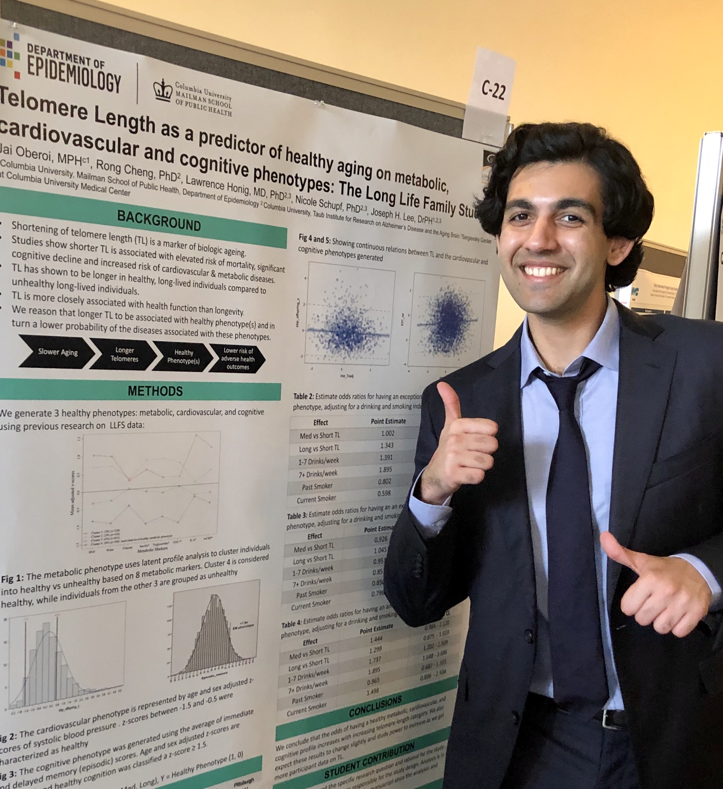

Recent MPH graduate from [Columbia University, Mailman School of Public Health](https://www.publichealth.columbia.edu/)  
Epidemiology & Biostatistics

*"Science is more Art than Science"*

 

 

# About

Originally, I am from Mumbai, India. I obtained by BA from [Emory University](http://www.emory.edu/home/index.html) in Health Science (2017), and now I live in New York City. I obtained by MPH from  [Columbia University, Mailman School of Public Health](https://www.mailman.columbia.edu/) in *Epidemiology* with a certificate in *Applied Biostatistics* (2020), where I was a Teaching Assistant for a Biostatistics class called Analysis of Categorical Data. My thesis involved reseach at [Columbia University Irving Medical Center](https://www.cuimc.columbia.edu/), where I focued on how biologic aging measured by [telomere length](https://www.ncbi.nlm.nih.gov/pmc/articles/PMC4292845/) predicts exceptional metabolic, cardiovascular, and cognitive phenotypes.  

My current research interests include machine learning in epidemiology, predictive models, longitudinal data analysis, data mining, and the application of statistics and epidemiology to genetic research questions. 

